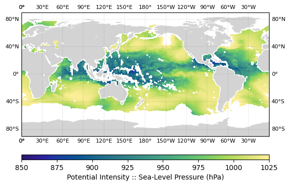
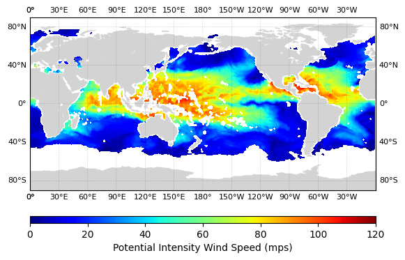

```python
# Load the Python environment.
import matplotlib.pyplot as plt
import numpy
from tcdiags.tcdiags import TCDiags
from plottools.build_basemap import build_basemap
from plottools.draw_basemap import draw_basemap
from tools import parser_interface
```

#### User Configuration


```python
# Define the path to the YAML-formatted TC-diagnostics configuration files.
yaml_file = "/Users/henry.winterbottom/trunk/UFS/ufs_tcdiags/parm/tcdiags.demo.yaml"
tcpi_file = "/Users/henry.winterbottom/trunk/UFS/ufs_tcdiags/parm/tcdiags.be2002_pi.yaml" 

# Define the TC MPI metric plotting attributes.
import cmocean
mslp_cint = 25.0
mslp_cmax = 1025.0
mslp_cmin = 850.0
mslp_cmap = cmocean.cm.haline

vmax_cint = 20.0
vmax_cmax = 120.0
vmax_cmin = 0.0
vmax_cmap = "jet"
```

#### Compute and plot the tropical cyclone potential intensity metrics.


```python
# Compute the TC potential intensity attributes.
options_obj = parser_interface.object_define()
options_obj.yaml_file = yaml_file
options_obj.tcpi = tcpi_file
tcpi_obj = TCDiags(options_obj=options_obj)
tcpi = tcpi_obj.run(write_output=False)
```

```json
   2023-06-19 16:09:32 :: WARNING :: utils.schema_interface: Schema optional value derived has not been defined; setting to default value False.
   2023-06-19 16:09:32 :: WARNING :: utils.schema_interface: Schema optional value method has not been defined; setting to default value None.
   2023-06-19 16:09:32 :: WARNING :: utils.schema_interface: Schema optional value module has not been defined; setting to default value None.
   2023-06-19 16:09:32 :: WARNING :: utils.schema_interface: Schema optional value scale_mult has not been defined; setting to default value 1.0.
   2023-06-19 16:09:32 :: WARNING :: utils.schema_interface: Schema optional value scale_add has not been defined; setting to default value 0.0.
   2023-06-19 16:09:32 :: INFO :: utils.schema_interface: 
    
    +--------------+--------+------------+-----------------+---------------------------------------------------------------------------+
    |   Variable   |  Type  |  Optional  | Default Value   | Assigned Value                                                            |
    +==============+========+============+=================+===========================================================================+
    |  scale_mult  | float  |    True    | 1.0             | 1.0                                                                       |
    |    units     |  str   |   False    |                 | kg/kg                                                                     |
    |   squeeze    |  bool  |    True    | False           | True                                                                      |
    |     name     |  str   |   False    |                 | spfh                                                                      |
    | squeeze_axis |  int   |    True    | 0               | 0                                                                         |
    |   flip_lat   |  bool  |    True    | False           | True                                                                      |
    |  ncvarname   |  str   |    True    |                 | spfh                                                                      |
    |   derived    |  bool  |    True    | False           | False                                                                     |
    |    ncfile    |  str   |    True    |                 | /Users/henry.winterbottom/work/UFS/ufs_tcdiags//C96_era5anl_2016100100.nc |
    |  scale_add   | float  |    True    | 0.0             | 0.0                                                                       |
    |    flip_z    |  bool  |    True    | False           | True                                                                      |
    +--------------+--------+------------+-----------------+---------------------------------------------------------------------------+
    
   [0m
   [37;21m2023-06-19 16:09:32 :: INFO :: utils.schema_interface: Schema successfully validated.
   [37;21m2023-06-19 16:09:32 :: INFO :: tcdiags.io.vario: Reading variable specific_humidity from netCDF-formatted file path /Users/henry.winterbottom/work/UFS/ufs_tcdiags//C96_era5anl_2016100100.nc.
   [38;5;226m2023-06-19 16:09:32 :: WARNING :: tcdiags.io.vario: Flipping array along the vertical axis.
   [38;5;226m2023-06-19 16:09:32 :: WARNING :: tcdiags.io.vario: Flipping array along the latitudinal axis.
   [38;5;226m2023-06-19 16:09:32 :: WARNING :: utils.schema_interface: Schema optional value derived has not been defined; setting to default value False.
   [38;5;226m2023-06-19 16:09:32 :: WARNING :: utils.schema_interface: Schema optional value method has not been defined; setting to default value None.
   [38;5;226m2023-06-19 16:09:32 :: WARNING :: utils.schema_interface: Schema optional value module has not been defined; setting to default value None.
   [38;5;226m2023-06-19 16:09:32 :: WARNING :: utils.schema_interface: Schema optional value scale_mult has not been defined; setting to default value 1.0.
   [38;5;226m2023-06-19 16:09:32 :: WARNING :: utils.schema_interface: Schema optional value scale_add has not been defined; setting to default value 0.0.
   [37;21m2023-06-19 16:09:32 :: INFO :: utils.schema_interface: 
    
    +--------------+--------+------------+-----------------+---------------------------------------------------------------------------+
    |   Variable   |  Type  |  Optional  | Default Value   | Assigned Value                                                            |
    +==============+========+============+=================+===========================================================================+
    |  scale_mult  | float  |    True    | 1.0             | 1.0                                                                       |
    |   squeeze    |  bool  |    True    | False           | True                                                                      |
    | squeeze_axis |  int   |    True    | 0               | 0                                                                         |
    |   flip_lat   |  bool  |    True    | False           | True                                                                      |
    |    units     |  str   |   False    |                 | mps                                                                       |
    |  ncvarname   |  str   |    True    |                 | ugrd                                                                      |
    |   derived    |  bool  |    True    | False           | False                                                                     |
    |    ncfile    |  str   |    True    |                 | /Users/henry.winterbottom/work/UFS/ufs_tcdiags//C96_era5anl_2016100100.nc |
    |  scale_add   | float  |    True    | 0.0             | 0.0                                                                       |
    |    flip_z    |  bool  |    True    | False           | True                                                                      |
    |     name     |  str   |   False    |                 | uwnd                                                                      |
    +--------------+--------+------------+-----------------+---------------------------------------------------------------------------+
    
   [0m
   [37;21m2023-06-19 16:09:32 :: INFO :: utils.schema_interface: Schema successfully validated.
   [37;21m2023-06-19 16:09:32 :: INFO :: tcdiags.io.vario: Reading variable uwind from netCDF-formatted file path /Users/henry.winterbottom/work/UFS/ufs_tcdiags//C96_era5anl_2016100100.nc.
   [38;5;226m2023-06-19 16:09:33 :: WARNING :: tcdiags.io.vario: Flipping array along the vertical axis.
   [38;5;226m2023-06-19 16:09:33 :: WARNING :: tcdiags.io.vario: Flipping array along the latitudinal axis.
   [38;5;226m2023-06-19 16:09:33 :: WARNING :: utils.schema_interface: Schema optional value derived has not been defined; setting to default value False.
   [38;5;226m2023-06-19 16:09:33 :: WARNING :: utils.schema_interface: Schema optional value method has not been defined; setting to default value None.
   [38;5;226m2023-06-19 16:09:33 :: WARNING :: utils.schema_interface: Schema optional value module has not been defined; setting to default value None.
   [38;5;226m2023-06-19 16:09:33 :: WARNING :: utils.schema_interface: Schema optional value scale_mult has not been defined; setting to default value 1.0.
   [38;5;226m2023-06-19 16:09:33 :: WARNING :: utils.schema_interface: Schema optional value scale_add has not been defined; setting to default value 0.0.
   [37;21m2023-06-19 16:09:33 :: INFO :: utils.schema_interface: 
    
    +--------------+--------+------------+-----------------+---------------------------------------------------------------------------+
    |   Variable   |  Type  |  Optional  | Default Value   | Assigned Value                                                            |
    +==============+========+============+=================+===========================================================================+
    |  scale_mult  | float  |    True    | 1.0             | 1.0                                                                       |
    |   squeeze    |  bool  |    True    | False           | True                                                                      |
    |     name     |  str   |   False    |                 | vwnd                                                                      |
    | squeeze_axis |  int   |    True    | 0               | 0                                                                         |
    |   flip_lat   |  bool  |    True    | False           | True                                                                      |
    |   derived    |  bool  |    True    | False           | False                                                                     |
    |    ncfile    |  str   |    True    |                 | /Users/henry.winterbottom/work/UFS/ufs_tcdiags//C96_era5anl_2016100100.nc |
    |  scale_add   | float  |    True    | 0.0             | 0.0                                                                       |
    |    flip_z    |  bool  |    True    | False           | True                                                                      |
    |  ncvarname   |  str   |    True    |                 | vgrd                                                                      |
    |    units     |  str   |   False    |                 | mps                                                                       |
    +--------------+--------+------------+-----------------+---------------------------------------------------------------------------+
    
   [0m
   [37;21m2023-06-19 16:09:33 :: INFO :: utils.schema_interface: Schema successfully validated.
   [37;21m2023-06-19 16:09:33 :: INFO :: tcdiags.io.vario: Reading variable vwind from netCDF-formatted file path /Users/henry.winterbottom/work/UFS/ufs_tcdiags//C96_era5anl_2016100100.nc.
   [38;5;226m2023-06-19 16:09:33 :: WARNING :: tcdiags.io.vario: Flipping array along the vertical axis.
   [38;5;226m2023-06-19 16:09:33 :: WARNING :: tcdiags.io.vario: Flipping array along the latitudinal axis.
   [38;5;226m2023-06-19 16:09:33 :: WARNING :: utils.schema_interface: Schema optional value derived has not been defined; setting to default value False.
   [38;5;226m2023-06-19 16:09:33 :: WARNING :: utils.schema_interface: Schema optional value method has not been defined; setting to default value None.
   [38;5;226m2023-06-19 16:09:33 :: WARNING :: utils.schema_interface: Schema optional value module has not been defined; setting to default value None.
   [38;5;226m2023-06-19 16:09:33 :: WARNING :: utils.schema_interface: Schema optional value scale_mult has not been defined; setting to default value 1.0.
   [38;5;226m2023-06-19 16:09:33 :: WARNING :: utils.schema_interface: Schema optional value scale_add has not been defined; setting to default value 0.0.
   [37;21m2023-06-19 16:09:33 :: INFO :: utils.schema_interface: 
    
    +--------------+--------+------------+-----------------+---------------------------------------------------------------------------+
    |   Variable   |  Type  |  Optional  | Default Value   | Assigned Value                                                            |
    +==============+========+============+=================+===========================================================================+
    |  scale_mult  | float  |    True    | 1.0             | 1.0                                                                       |
    |   squeeze    |  bool  |    True    | False           | True                                                                      |
    | squeeze_axis |  int   |    True    | 0               | 0                                                                         |
    |    units     |  str   |   False    |                 | K                                                                         |
    |   flip_lat   |  bool  |    True    | False           | True                                                                      |
    |  ncvarname   |  str   |    True    |                 | tmp                                                                       |
    |   derived    |  bool  |    True    | False           | False                                                                     |
    |    ncfile    |  str   |    True    |                 | /Users/henry.winterbottom/work/UFS/ufs_tcdiags//C96_era5anl_2016100100.nc |
    |  scale_add   | float  |    True    | 0.0             | 0.0                                                                       |
    |     name     |  str   |   False    |                 | temp                                                                      |
    |    flip_z    |  bool  |    True    | False           | True                                                                      |
    +--------------+--------+------------+-----------------+---------------------------------------------------------------------------+
    
   [0m
   [37;21m2023-06-19 16:09:33 :: INFO :: utils.schema_interface: Schema successfully validated.
   [37;21m2023-06-19 16:09:33 :: INFO :: tcdiags.io.vario: Reading variable temperature from netCDF-formatted file path /Users/henry.winterbottom/work/UFS/ufs_tcdiags//C96_era5anl_2016100100.nc.
   [38;5;226m2023-06-19 16:09:33 :: WARNING :: tcdiags.io.vario: Flipping array along the vertical axis.
   [38;5;226m2023-06-19 16:09:33 :: WARNING :: tcdiags.io.vario: Flipping array along the latitudinal axis.
   [38;5;226m2023-06-19 16:09:33 :: WARNING :: utils.schema_interface: Schema optional value derived has not been defined; setting to default value False.
   [38;5;226m2023-06-19 16:09:33 :: WARNING :: utils.schema_interface: Schema optional value flip_z has not been defined; setting to default value False.
   [38;5;226m2023-06-19 16:09:33 :: WARNING :: utils.schema_interface: Schema optional value method has not been defined; setting to default value None.
   [38;5;226m2023-06-19 16:09:33 :: WARNING :: utils.schema_interface: Schema optional value module has not been defined; setting to default value None.
   [38;5;226m2023-06-19 16:09:33 :: WARNING :: utils.schema_interface: Schema optional value scale_mult has not been defined; setting to default value 1.0.
   [38;5;226m2023-06-19 16:09:33 :: WARNING :: utils.schema_interface: Schema optional value squeeze has not been defined; setting to default value False.
   [38;5;226m2023-06-19 16:09:33 :: WARNING :: utils.schema_interface: Schema optional value squeeze_axis has not been defined; setting to default value 0.
   [37;21m2023-06-19 16:09:33 :: INFO :: utils.schema_interface: 
    
    +--------------+--------+------------+-----------------+---------------------------------------------------------------------------+
    |   Variable   |  Type  |  Optional  | Default Value   | Assigned Value                                                            |
    +==============+========+============+=================+===========================================================================+
    |  scale_mult  | float  |    True    | 1.0             | 1.0                                                                       |
    |   squeeze    |  bool  |    True    | False           | False                                                                     |
    | squeeze_axis |  int   |    True    | 0               | 0                                                                         |
    |   flip_lat   |  bool  |    True    | False           | True                                                                      |
    |     name     |  str   |   False    |                 | lon                                                                       |
    |    units     |  str   |   False    |                 | degree                                                                    |
    |  ncvarname   |  str   |    True    |                 | lon                                                                       |
    |   derived    |  bool  |    True    | False           | False                                                                     |
    |    ncfile    |  str   |    True    |                 | /Users/henry.winterbottom/work/UFS/ufs_tcdiags//C96_era5anl_2016100100.nc |
    |  scale_add   | float  |    True    | 0.0             | -360.0                                                                    |
    |    flip_z    |  bool  |    True    | False           | False                                                                     |
    +--------------+--------+------------+-----------------+---------------------------------------------------------------------------+
    
   [0m
   [37;21m2023-06-19 16:09:33 :: INFO :: utils.schema_interface: Schema successfully validated.
   [37;21m2023-06-19 16:09:33 :: INFO :: tcdiags.io.vario: Reading variable longitude from netCDF-formatted file path /Users/henry.winterbottom/work/UFS/ufs_tcdiags//C96_era5anl_2016100100.nc.
   [38;5;226m2023-06-19 16:09:33 :: WARNING :: tcdiags.io.vario: Flipping array along the latitudinal axis.
   [38;5;226m2023-06-19 16:09:33 :: WARNING :: utils.schema_interface: Schema optional value derived has not been defined; setting to default value False.
   [38;5;226m2023-06-19 16:09:33 :: WARNING :: utils.schema_interface: Schema optional value flip_z has not been defined; setting to default value False.
   [38;5;226m2023-06-19 16:09:33 :: WARNING :: utils.schema_interface: Schema optional value method has not been defined; setting to default value None.
   [38;5;226m2023-06-19 16:09:33 :: WARNING :: utils.schema_interface: Schema optional value module has not been defined; setting to default value None.
   [38;5;226m2023-06-19 16:09:33 :: WARNING :: utils.schema_interface: Schema optional value scale_mult has not been defined; setting to default value 1.0.
   [38;5;226m2023-06-19 16:09:33 :: WARNING :: utils.schema_interface: Schema optional value scale_add has not been defined; setting to default value 0.0.
   [38;5;226m2023-06-19 16:09:33 :: WARNING :: utils.schema_interface: Schema optional value squeeze has not been defined; setting to default value False.
   [38;5;226m2023-06-19 16:09:33 :: WARNING :: utils.schema_interface: Schema optional value squeeze_axis has not been defined; setting to default value 0.
   [37;21m2023-06-19 16:09:33 :: INFO :: utils.schema_interface: 
    
    +--------------+--------+------------+-----------------+---------------------------------------------------------------------------+
    |   Variable   |  Type  |  Optional  | Default Value   | Assigned Value                                                            |
    +==============+========+============+=================+===========================================================================+
    |  scale_mult  | float  |    True    | 1.0             | 1.0                                                                       |
    |   squeeze    |  bool  |    True    | False           | False                                                                     |
    | squeeze_axis |  int   |    True    | 0               | 0                                                                         |
    |   flip_lat   |  bool  |    True    | False           | True                                                                      |
    |     name     |  str   |   False    |                 | lat                                                                       |
    |    units     |  str   |   False    |                 | degree                                                                    |
    |   derived    |  bool  |    True    | False           | False                                                                     |
    |    ncfile    |  str   |    True    |                 | /Users/henry.winterbottom/work/UFS/ufs_tcdiags//C96_era5anl_2016100100.nc |
    |  scale_add   | float  |    True    | 0.0             | 0.0                                                                       |
    |  ncvarname   |  str   |    True    |                 | lat                                                                       |
    |    flip_z    |  bool  |    True    | False           | False                                                                     |
    +--------------+--------+------------+-----------------+---------------------------------------------------------------------------+
    
   [0m
   [37;21m2023-06-19 16:09:33 :: INFO :: utils.schema_interface: Schema successfully validated.
   [37;21m2023-06-19 16:09:33 :: INFO :: tcdiags.io.vario: Reading variable latitude from netCDF-formatted file path /Users/henry.winterbottom/work/UFS/ufs_tcdiags//C96_era5anl_2016100100.nc.
   [38;5;226m2023-06-19 16:09:33 :: WARNING :: tcdiags.io.vario: Flipping array along the latitudinal axis.
   [38;5;226m2023-06-19 16:09:33 :: WARNING :: utils.schema_interface: Schema optional value derived has not been defined; setting to default value False.
   [38;5;226m2023-06-19 16:09:33 :: WARNING :: utils.schema_interface: Schema optional value flip_z has not been defined; setting to default value False.
   [38;5;226m2023-06-19 16:09:33 :: WARNING :: utils.schema_interface: Schema optional value method has not been defined; setting to default value None.
   [38;5;226m2023-06-19 16:09:33 :: WARNING :: utils.schema_interface: Schema optional value module has not been defined; setting to default value None.
   [38;5;226m2023-06-19 16:09:33 :: WARNING :: utils.schema_interface: Schema optional value scale_mult has not been defined; setting to default value 1.0.
   [38;5;226m2023-06-19 16:09:33 :: WARNING :: utils.schema_interface: Schema optional value scale_add has not been defined; setting to default value 0.0.
   [37;21m2023-06-19 16:09:33 :: INFO :: utils.schema_interface: 
    
    +--------------+--------+------------+-----------------+---------------------------------------------------------------------------+
    |   Variable   |  Type  |  Optional  | Default Value   | Assigned Value                                                            |
    +==============+========+============+=================+===========================================================================+
    |  scale_mult  | float  |    True    | 1.0             | 1.0                                                                       |
    |  ncvarname   |  str   |    True    |                 | pressfc                                                                   |
    |     name     |  str   |   False    |                 | psfc                                                                      |
    |   squeeze    |  bool  |    True    | False           | True                                                                      |
    |    units     |  str   |   False    |                 | pascals                                                                   |
    | squeeze_axis |  int   |    True    | 0               | 0                                                                         |
    |   flip_lat   |  bool  |    True    | False           | True                                                                      |
    |   derived    |  bool  |    True    | False           | False                                                                     |
    |    ncfile    |  str   |    True    |                 | /Users/henry.winterbottom/work/UFS/ufs_tcdiags//C96_era5anl_2016100100.nc |
    |  scale_add   | float  |    True    | 0.0             | 0.0                                                                       |
    |    flip_z    |  bool  |    True    | False           | False                                                                     |
    +--------------+--------+------------+-----------------+---------------------------------------------------------------------------+
    
   [0m
   [37;21m2023-06-19 16:09:33 :: INFO :: utils.schema_interface: Schema successfully validated.
   [37;21m2023-06-19 16:09:33 :: INFO :: tcdiags.io.vario: Reading variable surface_pressure from netCDF-formatted file path /Users/henry.winterbottom/work/UFS/ufs_tcdiags//C96_era5anl_2016100100.nc.
   [38;5;226m2023-06-19 16:09:33 :: WARNING :: tcdiags.io.vario: Flipping array along the latitudinal axis.
   [38;5;226m2023-06-19 16:09:33 :: WARNING :: utils.schema_interface: Schema optional value derived has not been defined; setting to default value False.
   [38;5;226m2023-06-19 16:09:33 :: WARNING :: utils.schema_interface: Schema optional value flip_z has not been defined; setting to default value False.
   [38;5;226m2023-06-19 16:09:33 :: WARNING :: utils.schema_interface: Schema optional value method has not been defined; setting to default value None.
   [38;5;226m2023-06-19 16:09:33 :: WARNING :: utils.schema_interface: Schema optional value module has not been defined; setting to default value None.
   [38;5;226m2023-06-19 16:09:33 :: WARNING :: utils.schema_interface: Schema optional value scale_add has not been defined; setting to default value 0.0.
   [37;21m2023-06-19 16:09:33 :: INFO :: utils.schema_interface: 
    
    +--------------+--------+------------+-----------------+---------------------------------------------------------------------------+
    |   Variable   |  Type  |  Optional  | Default Value   | Assigned Value                                                            |
    +==============+========+============+=================+===========================================================================+
    |  ncvarname   |  str   |    True    |                 | hgtsfc                                                                    |
    |   squeeze    |  bool  |    True    | False           | True                                                                      |
    |    units     |  str   |   False    |                 | gpm                                                                       |
    | squeeze_axis |  int   |    True    | 0               | 0                                                                         |
    |  scale_mult  | float  |    True    | 1.0             | 0.98                                                                      |
    |   flip_lat   |  bool  |    True    | False           | True                                                                      |
    |   derived    |  bool  |    True    | False           | False                                                                     |
    |     name     |  str   |   False    |                 | zsfc                                                                      |
    |    ncfile    |  str   |    True    |                 | /Users/henry.winterbottom/work/UFS/ufs_tcdiags//C96_era5anl_2016100100.nc |
    |  scale_add   | float  |    True    | 0.0             | 0.0                                                                       |
    |    flip_z    |  bool  |    True    | False           | False                                                                     |
    +--------------+--------+------------+-----------------+---------------------------------------------------------------------------+
    
   [0m
   [37;21m2023-06-19 16:09:33 :: INFO :: utils.schema_interface: Schema successfully validated.
   [37;21m2023-06-19 16:09:33 :: INFO :: tcdiags.io.vario: Reading variable surface_height from netCDF-formatted file path /Users/henry.winterbottom/work/UFS/ufs_tcdiags//C96_era5anl_2016100100.nc.
   [38;5;226m2023-06-19 16:09:33 :: WARNING :: tcdiags.io.vario: Flipping array along the latitudinal axis.
   [38;5;226m2023-06-19 16:09:33 :: WARNING :: utils.schema_interface: Schema optional value scale_mult has not been defined; setting to default value 1.0.
   [38;5;226m2023-06-19 16:09:33 :: WARNING :: utils.schema_interface: Schema optional value scale_add has not been defined; setting to default value 0.0.
   [37;21m2023-06-19 16:09:33 :: INFO :: utils.schema_interface: 
    
    +--------------+--------+------------+-----------------+---------------------------------------------------------------------------+
    |   Variable   |  Type  |  Optional  | Default Value   | Assigned Value                                                            |
    +==============+========+============+=================+===========================================================================+
    |  scale_mult  | float  |    True    | 1.0             | 1.0                                                                       |
    |    module    |  str   |    True    |                 | ufs_diags.derived.atmos.pressures                                         |
    |   squeeze    |  bool  |    True    | False           | True                                                                      |
    | squeeze_axis |  int   |    True    | 0               | 0                                                                         |
    |  ncvarname   |  str   |    True    |                 | dpres                                                                     |
    |    units     |  str   |   False    |                 | pascals                                                                   |
    |   flip_lat   |  bool  |    True    | False           | True                                                                      |
    |   derived    |  bool  |    True    | False           | True                                                                      |
    |     name     |  str   |   False    |                 | pres                                                                      |
    |    ncfile    |  str   |    True    |                 | /Users/henry.winterbottom/work/UFS/ufs_tcdiags//C96_era5anl_2016100100.nc |
    |  scale_add   | float  |    True    | 0.0             | 0.0                                                                       |
    |    flip_z    |  bool  |    True    | False           | True                                                                      |
    |    method    |  str   |    True    |                 | pressure_from_thickness                                                   |
    +--------------+--------+------------+-----------------+---------------------------------------------------------------------------+
    
   [0m
   [37;21m2023-06-19 16:09:33 :: INFO :: utils.schema_interface: Schema successfully validated.
   [37;21m2023-06-19 16:09:33 :: INFO :: tcdiags.io.vario: Reading variable pressure from netCDF-formatted file path /Users/henry.winterbottom/work/UFS/ufs_tcdiags//C96_era5anl_2016100100.nc.
   [38;5;226m2023-06-19 16:09:33 :: WARNING :: tcdiags.io.vario: Flipping array along the vertical axis.
   [38;5;226m2023-06-19 16:09:33 :: WARNING :: tcdiags.io.vario: Flipping array along the latitudinal axis.
   [38;5;226m2023-06-19 16:09:33 :: WARNING :: utils.schema_interface: Schema optional value flip_lat has not been defined; setting to default value False.
   [38;5;226m2023-06-19 16:09:33 :: WARNING :: utils.schema_interface: Schema optional value flip_z has not been defined; setting to default value False.
   [38;5;226m2023-06-19 16:09:33 :: WARNING :: utils.schema_interface: Schema optional value ncfile has not been defined; setting to default value None.
   [38;5;226m2023-06-19 16:09:33 :: WARNING :: utils.schema_interface: Schema optional value scale_mult has not been defined; setting to default value 1.0.
   [38;5;226m2023-06-19 16:09:33 :: WARNING :: utils.schema_interface: Schema optional value scale_add has not been defined; setting to default value 0.0.
   [38;5;226m2023-06-19 16:09:33 :: WARNING :: utils.schema_interface: Schema optional value squeeze has not been defined; setting to default value False.
   [38;5;226m2023-06-19 16:09:33 :: WARNING :: utils.schema_interface: Schema optional value squeeze_axis has not been defined; setting to default value 0.
   [38;5;226m2023-06-19 16:09:33 :: WARNING :: utils.schema_interface: Schema optional value ncvarname has not been defined; setting to default value None.
   [37;21m2023-06-19 16:09:33 :: INFO :: utils.schema_interface: 
    
    +--------------+--------+------------+-----------------+---------------------------------+
    |   Variable   |  Type  |  Optional  | Default Value   | Assigned Value                  |
    +==============+========+============+=================+=================================+
    |  scale_mult  | float  |    True    | 1.0             | 1.0                             |
    |   flip_lat   |  bool  |    True    | False           | False                           |
    |    module    |  str   |    True    |                 | ufs_diags.derived.atmos.heights |
    |   squeeze    |  bool  |    True    | False           | False                           |
    | squeeze_axis |  int   |    True    | 0               | 0                               |
    |    units     |  str   |   False    |                 | m                               |
    |   derived    |  bool  |    True    | False           | True                            |
    |     name     |  str   |   False    |                 | hght                            |
    |    method    |  str   |    True    |                 | height_from_pressure            |
    |  scale_add   | float  |    True    | 0.0             | 0.0                             |
    |    flip_z    |  bool  |    True    | False           | False                           |
    +--------------+--------+------------+-----------------+---------------------------------+
    
   [0m
   [37;21m2023-06-19 16:09:33 :: INFO :: utils.schema_interface: Schema successfully validated.
   [38;5;226m2023-06-19 16:09:33 :: WARNING :: utils.schema_interface: Schema optional value flip_lat has not been defined; setting to default value False.
   [38;5;226m2023-06-19 16:09:33 :: WARNING :: utils.schema_interface: Schema optional value flip_z has not been defined; setting to default value False.
   [38;5;226m2023-06-19 16:09:33 :: WARNING :: utils.schema_interface: Schema optional value ncfile has not been defined; setting to default value None.
   [38;5;226m2023-06-19 16:09:33 :: WARNING :: utils.schema_interface: Schema optional value scale_mult has not been defined; setting to default value 1.0.
   [38;5;226m2023-06-19 16:09:33 :: WARNING :: utils.schema_interface: Schema optional value scale_add has not been defined; setting to default value 0.0.
   [38;5;226m2023-06-19 16:09:33 :: WARNING :: utils.schema_interface: Schema optional value squeeze has not been defined; setting to default value False.
   [38;5;226m2023-06-19 16:09:33 :: WARNING :: utils.schema_interface: Schema optional value squeeze_axis has not been defined; setting to default value 0.
   [38;5;226m2023-06-19 16:09:33 :: WARNING :: utils.schema_interface: Schema optional value ncvarname has not been defined; setting to default value None.
   [37;21m2023-06-19 16:09:33 :: INFO :: utils.schema_interface: 
    
    +--------------+--------+------------+-----------------+-----------------------------------+
    |   Variable   |  Type  |  Optional  | Default Value   | Assigned Value                    |
    +==============+========+============+=================+===================================+
    |  scale_mult  | float  |    True    | 1.0             | 1.0                               |
    |     name     |  str   |   False    |                 | pslp                              |
    |    units     |  str   |   False    |                 | pascal                            |
    |    module    |  str   |    True    |                 | ufs_diags.derived.atmos.pressures |
    |   flip_lat   |  bool  |    True    | False           | False                             |
    |   squeeze    |  bool  |    True    | False           | False                             |
    | squeeze_axis |  int   |    True    | 0               | 0                                 |
    |    method    |  str   |    True    |                 | pressure_to_sealevel              |
    |   derived    |  bool  |    True    | False           | True                              |
    |  scale_add   | float  |    True    | 0.0             | 0.0                               |
    |    flip_z    |  bool  |    True    | False           | False                             |
    +--------------+--------+------------+-----------------+-----------------------------------+
    
   [0m
   [37;21m2023-06-19 16:09:33 :: INFO :: utils.schema_interface: Schema successfully validated.
   [38;5;226m2023-06-19 16:09:33 :: WARNING :: utils.schema_interface: Schema optional value flip_lat has not been defined; setting to default value False.
   [38;5;226m2023-06-19 16:09:33 :: WARNING :: utils.schema_interface: Schema optional value flip_z has not been defined; setting to default value False.
   [38;5;226m2023-06-19 16:09:33 :: WARNING :: utils.schema_interface: Schema optional value ncfile has not been defined; setting to default value None.
   [38;5;226m2023-06-19 16:09:33 :: WARNING :: utils.schema_interface: Schema optional value scale_mult has not been defined; setting to default value 1.0.
   [38;5;226m2023-06-19 16:09:33 :: WARNING :: utils.schema_interface: Schema optional value scale_add has not been defined; setting to default value 0.0.
   [38;5;226m2023-06-19 16:09:33 :: WARNING :: utils.schema_interface: Schema optional value squeeze has not been defined; setting to default value False.
   [38;5;226m2023-06-19 16:09:33 :: WARNING :: utils.schema_interface: Schema optional value squeeze_axis has not been defined; setting to default value 0.
   [38;5;226m2023-06-19 16:09:33 :: WARNING :: utils.schema_interface: Schema optional value ncvarname has not been defined; setting to default value None.
   [37;21m2023-06-19 16:09:33 :: INFO :: utils.schema_interface: 
    
    +--------------+--------+------------+-----------------+----------------------------------+
    |   Variable   |  Type  |  Optional  | Default Value   | Assigned Value                   |
    +==============+========+============+=================+==================================+
    |  scale_mult  | float  |    True    | 1.0             | 1.0                              |
    |    units     |  str   |   False    |                 | kg/kg                            |
    |   flip_lat   |  bool  |    True    | False           | False                            |
    |   squeeze    |  bool  |    True    | False           | False                            |
    | squeeze_axis |  int   |    True    | 0               | 0                                |
    |    method    |  str   |    True    |                 | spfh_to_mxrt                     |
    |    module    |  str   |    True    |                 | ufs_diags.derived.atmos.moisture |
    |   derived    |  bool  |    True    | False           | True                             |
    |     name     |  str   |   False    |                 | mxrt                             |
    |  scale_add   | float  |    True    | 0.0             | 0.0                              |
    |    flip_z    |  bool  |    True    | False           | False                            |
    +--------------+--------+------------+-----------------+----------------------------------+
    
   [0m
   [37;21m2023-06-19 16:09:33 :: INFO :: utils.schema_interface: Schema successfully validated.
   [37;21m2023-06-19 16:09:33 :: INFO :: tcdiags.io.vario: The geographical coordinate arrays are projected to 2-dimensions; doing nothing.
   [37;21m2023-06-19 16:09:34 :: INFO :: ufs_diags.derived.atmos.pressures: Computing pressure profile array of dimension (127, 192, 384).
   [37;21m2023-06-19 16:09:34 :: INFO :: ufs_diags.derived.atmos.heights: Computing the geometric height profile array of dimension (127, 192, 384).
   [37;21m2023-06-19 16:09:34 :: INFO :: ufs_diags.derived.atmos.moisture: Computing the mixing ratio array of dimension (127, 192, 384).
   [1;36m2023-06-19 16:09:34 :: INFO :: tcdiags.tcdiags.TCDiags: Beginning application tcpi.
   [37;21m2023-06-19 16:09:34 :: INFO :: utils.schema_interface: 
    
    +-------------+--------+------------+-----------------+----------------------------+
    |  Variable   |  Type  |  Optional  | Default Value   | Assigned Value             |
    +=============+========+============+=================+============================+
    |  mslp_max   | float  |    True    | 2000.0          | 2000.0                     |
    |    zmax     | float  |    True    | 10.0            | 0.0                        |
    | output_file |  str   |   False    |                 | /work/tcdiags.be2002_pi.nc |
    +-------------+--------+------------+-----------------+----------------------------+
    
   [0m
   [37;21m2023-06-19 16:09:34 :: INFO :: utils.schema_interface: Schema successfully validated.
   [37;21m2023-06-19 16:09:34 :: INFO :: tcdiags.diagnostics.BE2002: Computing the tropical cyclone potential intensity metrics.
   [1;36m2023-06-19 16:09:58 :: INFO :: tcdiags.tcdiags.TCDiags: Completed application tcpi.

```

```python
# Plot the TC PI minimum sea-level pressure metric.
levels = numpy.linspace(mslp_cmin, mslp_cmax, 255)
(basemap, x, y) = build_basemap(lat=tcpi.lats, lon=tcpi.lons)
draw_basemap(basemap=basemap)
basemap.contourf(x, y, tcpi.pmin.values, levels=levels, cmap=mslp_cmap)
ticks = numpy.arange(mslp_cmin, (mslp_cmax + 0.01), mslp_cint)
plt.colorbar(orientation="horizontal", ticks=ticks, pad=0.1,
    aspect=50, 
    label="Potential Intensity :: Sea-Level Pressure (hPa)")
plt.savefig("tcpi.pmin.png", dpi=500, transparent=True, bbox_inches="tight")
plt.show()   

# Plot the TC PI maximum wind speed metric.
levels = numpy.linspace(vmax_cmin, vmax_cmax, 255)
(basemap, x, y) = build_basemap(lat=tcpi.lats, lon=tcpi.lons)
draw_basemap(basemap=basemap)
basemap.contourf(x, y, tcpi.vmax.values, levels=levels, cmap=vmax_cmap)
ticks = numpy.arange(vmax_cmin, (vmax_cmax + 0.01), vmax_cint)
plt.colorbar(orientation="horizontal", ticks=ticks, pad=0.1,
            aspect=50, 
            label="Potential Intensity Wind Speed (mps)")
plt.savefig("tcpi.vmax.png", dpi=500, transparent=True, bbox_inches="tight")
plt.show()
```


    

    


    

    

